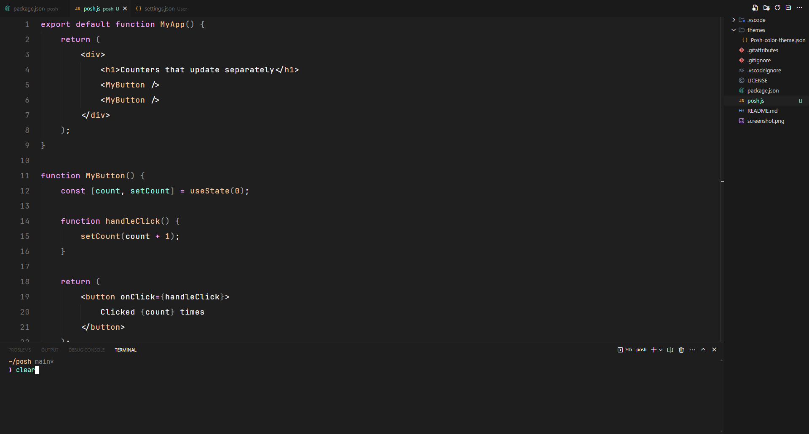

<div align="center">

# Posh

A blend of [Vesper++](https://marketplace.visualstudio.com/items?itemName=Obstinate.vesper-pp) and [Min Theme](https://marketplace.visualstudio.com/items?itemName=miguelsolorio.min-theme) designed to create a calm and focused coding environment, featuring soothing color schemes and optimized contrast to reduce eye strain and enhance readability. Ideal for long coding sessions and improving overall productivity.



</div>

## Installation

1. Install theme from the [Marketplace](https://marketplace.visualstudio.com/items?itemName=lucasdecastro.posh)
2. Go to `File > Preferences > Color Theme`
3. Select `Posh`

Install via CLI:

```
code --install-extension lucasdecastro.posh
```
